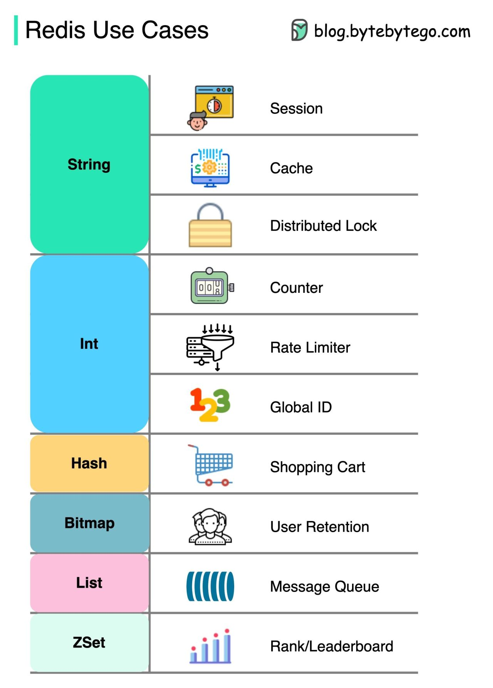

# Course Links

|                   Course Name                    |     Instructor     |                                       Course Link                                       |
| :----------------------------------------------: | :----------------: | :-------------------------------------------------------------------------------------: |
| Udemy - Master Redis - From Beginner to Advanced |    Adnan Waheed    |                    [Link](https://www.udemy.com/course/masterredis/)                    |
|           YouTube - Redis Crash Course           | Web Dev Simplified | [Link](https://www.youtube.com/watch?v=jgpVdJB2sKQ&t=1293s&ab_channel=WebDevSimplified) |

## ByteByteGo Notes

### TOP Redis Use Cases:

1. Caching

The most common use case is to utilize Redis for caching. This helps protect the database layer from overloading. Redis offers fast lookup for cached data and can help improve application performance.

2. Session Store

We use Redis to share user session data among stateless servers. Redis provides a centralized place to store session data and makes it easy to scale out servers.

3. Distributed Lock

We use Redis distributed locks to grant mutually exclusive access to shares resources. This prevents race conditions in distributed systems. Redis locks are easy to implement and automatically expire.

4. Counter and Rate Limiter

We use Redis to track like counts, view counts etc on social media apps. Redis counters provide atomic increments/decrements. We also use Redis to enforce rate limits on our API endpoints. This helps prevent abuse.

5. Leaderboard

Sorted sets make it easy to implement gaming leaderboards in Redis. We can add, update, or remove users from the leaderboard and query ranges efficiently.