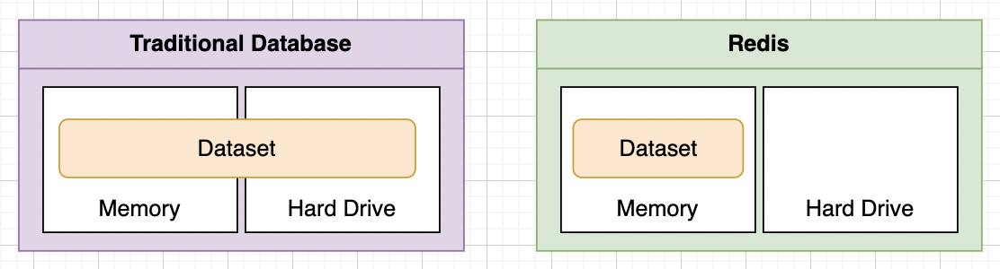

# Introduction to Redis

- Redis is a database.
- Why use Redis? Redis is **fast**!
    - All data is stored in memory. (can be challenging is working with a dataset that is larger than the memory provided)
    - Data is organized in simple data structures.
    - Redis has a simple feature set.
- Trade-off: It is more expensive to store data in memory.

# Commands for Adding and Querying Data

